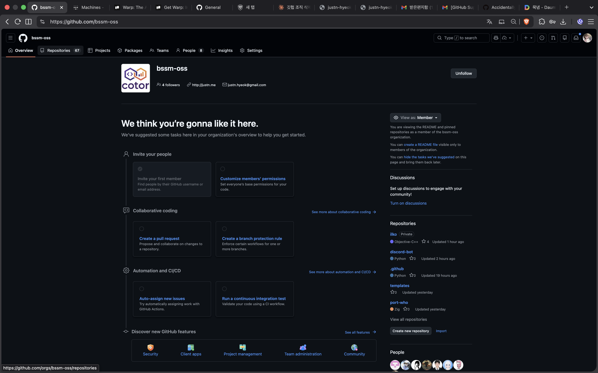

<h1 align="center">for-real</h1>
<p align="center"><strong>GitHub 레포/조직 실수 삭제 방지 크롬 익스텐션.</strong></p>

<p align="center">
  
  
  
</p>

<p align="center">
  테스트 레포 하나 지우려다가 9명짜리 조직 전체를 날려버린 사람이 만들었다.
  <br>
  <a href="./WHY.md">이거 만든 이유</a> · <a href="./README.md">English</a>
</p>

<p align="center">
  
  <br>
  <em><strong>rip.</strong></em>
</p>

---

## 하는 일

등록해둔 레포나 조직에서 "Delete this repository" 또는 "Delete this organization" 버튼을 눌러도 그냥 진행되지 않는다. 대신:

1. 자동으로 프로젝트 루트 페이지로 튕겨나감
2. `for real?` 모달이 뜨고 랜덤 20자 코드가 표시됨
3. 복붙 없이 직접 타이핑해서 통과하면 **5분간 삭제 언락**
4. 취소하면 아무 일도 일어나지 않음

5분 지나면 보호가 자동으로 다시 켜진다.

## 하지 않는 일

- **API 호출 방어 아님.** `gh repo delete`, `curl`, CLI 같은 걸로 지우는 건 이 익스텐션 밖의 영역이다
- **백업 도구 아님.** 어차피 위험한 작업 하기 전엔 코드를 어딘가 푸시해둬라
- **팀 권한 시스템 아님.** 로컬 브라우저에서만 동작한다. 팀원 각자 설치해야 한다

---

## 설치

아직 Chrome 웹 스토어에 없다. 직접 unpacked로 로드해야 한다.

1. 레포 클론
   ```bash
   git clone https://github.com/justn-hyeok/for-real.git
   ```
2. 크롬/브레이브/엣지에서 `chrome://extensions` 열기
3. 우상단 **개발자 모드** 켜기
4. **압축해제된 확장 프로그램 로드** 클릭 → `for-real` 폴더 선택

---

## 사용법

### 보호 목록에 추가하기

**방법 A — 현재 페이지에서 추가 (추천)**

1. 보호하고 싶은 GitHub 레포 또는 조직 페이지로 이동
2. 브라우저 툴바에서 for-real 아이콘 클릭
3. 팝업 상단에 **Current page** 카드가 감지된 내용과 함께 뜸. **Add to protected list** 버튼 클릭
4. 끝. 아래 목록에 `REPO` 또는 `ORG` 뱃지랑 같이 표시됨

**방법 B — 수동 입력**

1. for-real 아이콘 클릭
2. 보호 목록 아래 입력칸에 아래 둘 중 하나 입력:
   - `owner/repo` — 특정 레포 하나 (예: `justn-hyeok/dep-age`)
   - `owner` — 조직/유저 전체 (예: `justn-hyeok`)
3. Enter 또는 **Add** 클릭

목록은 Chrome 프로필 동기화(`chrome.storage.sync`)로 기기 간 공유된다.

### 목록에서 제거하기

목록 항목에 마우스 올리면 우측에 **×** 뜸. 그거 클릭.

### 보호된 항목 삭제 시도 시 흐름

1. GitHub의 **Delete this repository** (또는 organization) 버튼 클릭
2. for-real이 GitHub 확인 다이얼로그가 뜨기 전에 클릭을 가로채고 프로젝트 루트 페이지로 리다이렉트
3. 전체 화면 게이트 모달이 랜덤 20자 코드와 함께 뜸
4. 코드를 입력칸에 타이핑 — **복붙 불가**. 진짜로 직접 타이핑해야 함
5. 코드 정확히 맞추면 **Unlock for 5 min** 버튼 활성화
6. 그 버튼 누르면 5분간 삭제 언락. Settings로 다시 들어가서 평소대로 삭제하면 됨
7. 대신 **Cancel** 누르면 아무 일도 안 일어남. 루트에 그대로 남음

5분 지나면 언락이 자동 만료되고 다음 페이지 로드 때 보호가 다시 켜진다.

### 실제 시나리오

`justn-hyeok` (조직)를 등록해뒀다. 나중에 `github.com/organizations/justn-hyeok/settings/profile`로 들어가서 Danger Zone까지 스크롤, **Delete this organization**을 레포 설정 페이지인 줄 착각하고 클릭. for-real이 클릭을 잡아서 `github.com/justn-hyeok`로 튕기고 게이트를 띄움. 모달 보고 무슨 일이 일어날 뻔했는지 깨닫고 Cancel 클릭. 재앙 회피.

---

## 동작 원리

- `pointerdown`, `mousedown`, `click` 이벤트를 capture 단계에서 가로채서 React 핸들러가 발동하기 전에 차단
- 가로챈 시점에 `chrome.storage.local`에 짧은 TTL의 `pendingGate` 플래그 저장하고 프로젝트 루트로 리다이렉트
- 루트 페이지에서 content script가 플래그를 감지하고 native `<dialog>`를 `showModal()`로 띄움. 브라우저 top layer에 렌더링되므로 어떤 z-index 위에서도 보장됨
- 언락 상태는 `chrome.storage.local`에 항목별로 5분 만료 타임스탬프로 저장
- 보호 목록은 `chrome.storage.sync`로 Chrome 프로필 기기 간 동기화

---

## 한계

- **브라우저 전용.** API로 삭제하면 이 익스텐션을 완전히 우회한다
- **기기별 설치.** 보호 목록은 Chrome 프로필 동기화로 공유되지만 익스텐션 자체는 각 브라우저에 직접 설치해야 한다
- **감사 안 됐음.** 한 사람의 패닉에서 만들어졌다. 그만큼 신뢰해라

---

## License

MIT
