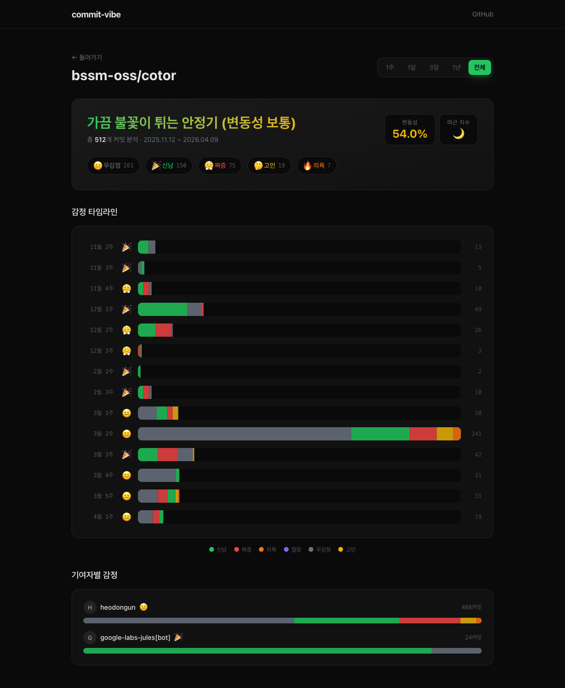

<p align="center">
  
</p>

<h1 align="center">commit-vibe</h1>
<p align="center"><strong>Visualize the emotional arc of any GitHub repo.</strong></p>

<p align="center">
  <a href="https://commit-vibe.fly.dev"></a>
  <a href="https://github.com/bssm-oss/commit-vibe/actions/workflows/ci.yml"></a>
  
  
</p>

Paste a GitHub repo URL. Get back a week-by-week emotional timeline — which weeks the team was shipping, which weeks they were firefighting, and what the overall vibe was.



---

## Quick Start

Visit **[commit-vibe.fly.dev](https://commit-vibe.fly.dev)** and paste any public GitHub repo URL.

```
https://github.com/owner/repo   or just   owner/repo
```

No login. No setup. Results in seconds for small repos.

---

## How It Works

```
GitHub repo URL
  ↓
Fetch all commits via GitHub API (paginated)
  ↓
Classify each commit message
  → Conventional prefix?  feat:  fix:  refactor:  → confidence 0.9
  → Body keyword match?   2+ matches              → confidence 0.65
  → Body keyword match?   1 match                 → confidence 0.5
  → No match              neutral fallback        → confidence 0.1
  ↓
Apply stress multiplier per commit timestamp
  weekday normal  →  1.0×
  late night      →  1.3×    (10 pm – 6 am)
  weekend         →  1.5×
  late night + weekend → 1.8×
  ↓
Group into calendar weeks (Monday-anchored)
  ↓
Calculate per-week dominant emotion (count × avg confidence)
  ↓
Render timeline  +  vibe summary  +  contributor breakdown
```

---

## Emotions

| Emotion | Emoji | Color | Keywords |
|---------|-------|-------|---------|
| Excited | 🎉 | `#22c55e` | feat, add, new, create, launch, ship |
| Frustrated | 😤 | `#ef4444` | fix, bug, patch, hotfix, workaround, hack |
| Motivated | 🔥 | `#f97316` | refactor, clean, improve, optimize, upgrade |
| Desperate | 💀 | `#8b5cf6` | revert, rollback, urgent, emergency, break |
| Neutral | 😐 | `#6b7280` | docs, chore, ci, config, update, bump |
| Thinking | 🤔 | `#eab308` | wip, tmp, test, experiment, try, draft |

Korean keywords are supported alongside English.

---

## Metrics

| Metric | What it measures |
|--------|-----------------|
| **Volatility** | How often the dominant emotion changes week over week (0 – 1.0) |
| **Revert ratio** | Share of `:desperate` commits out of total |
| **Stress index** | Average stress multiplier across all commits |

---

## Self-hosting

```bash
git clone https://github.com/bssm-oss/commit-vibe
cd commit-vibe
mix setup
mix phx.server        # → http://localhost:4000
```

Optional — set a GitHub token to raise the API rate limit from 60 to 5000 req/hr:

```bash
export GITHUB_TOKEN=ghp_xxx
mix phx.server
```

---

## Deploy (Fly.io)

```bash
fly launch   # first time
fly deploy   # subsequent
```

```toml
# fly.toml
app = 'commit-vibe'
primary_region = 'nrt'

[[vm]]
memory = '512mb'
cpu_kind = 'shared'
cpus = 1
```

Required secrets: `SECRET_KEY_BASE`, `GITHUB_TOKEN` (optional but recommended).

---

## Development

```bash
mix setup              # install deps + build assets
mix test               # run test suite
mix precommit          # compile --warnings-as-errors + format + test
mix phx.server         # dev server with live reload
```

Tests cover: emotion classifier, timeline builder, GitHub API client (Mox), OG image generator.

---

## License

MIT
